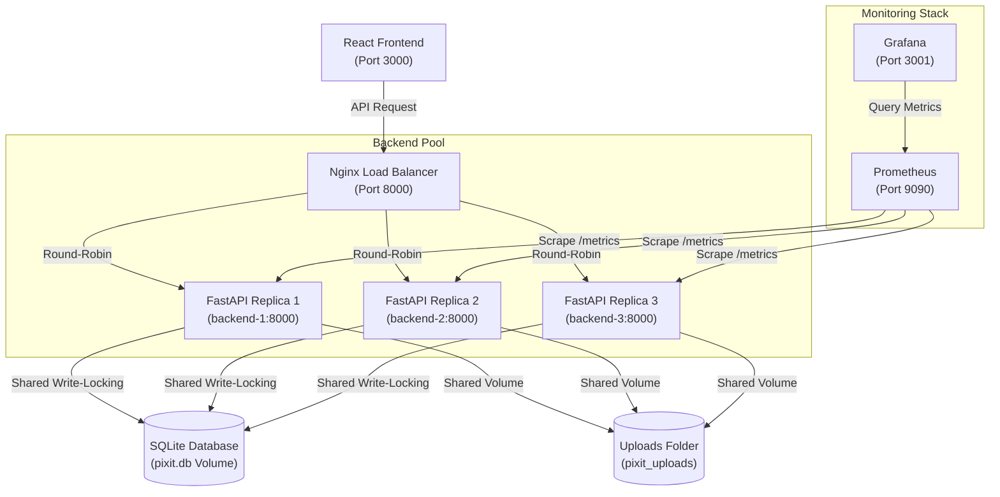

# PIXIT DevOps: Local Load Balancing & Monitoring Architecture

This document describes the high-availability local load balancing architecture implemented for PIXIT. It explains the request flow, proxy configuration, instance identification, and monitoring integration via Prometheus and Grafana.

---

## 1. Architectural Overview

The local architecture scales the FastAPI backend to three replicas and places a custom-built Nginx reverse proxy in front of them to serve as a load balancer.



### Key Components

| Component | Port | Role / Details |
| :--- | :--- | :--- |
| **React Frontend** | `3000` (Host) | Glassmorphic React SPA serving the client. Communicates with port `8000`. |
| **Nginx Load Balancer** | `8000` (Host) | Debian-based Nginx proxy routing traffic sequentially (Round-Robin). |
| **FastAPI Backend Pool** | `Internal` | 3 distinct Python replicas (`backend-1`, `backend-2`, `backend-3`). |
| **Shared SQLite DB** | `Volume` | Mounted SQLite database with write-lock safety across backend replicas. |
| **Prometheus** | `9090` (Host) | Scrapes metrics individually from all 3 backends and system exporters. |
| **Grafana** | `3001` (Host) | Visualizes per-instance CPU, RAM, request rate, and latency metrics. |

---

## 2. Nginx Load Balancer Configuration

The load balancer uses a customized Debian-based Nginx image. The configuration file (`nginx/nginx.conf`) handles request proxying, IP forwarding, and load distribution:

```nginx
user nginx;
worker_processes 1; # Consolidated to 1 process to maintain sequential load balancing state
error_log /var/log/nginx/error.log info;
pid /var/run/nginx.pid;

events {
    worker_connections 1024;
}

http {
    include /etc/nginx/mime.types;
    default_type application/octet-stream;

    log_format main '$remote_addr - $remote_user [$time_local] "$request" '
                      '$status $body_bytes_sent "$http_referer" '
                      '"$http_user_agent" "$http_x_forwarded_for" '
                      'upstream: $upstream_addr backend: $upstream_http_x_backend_server';

    access_log /var/log/nginx/access.log main;

    sendfile on;
    keepalive_timeout 65;

    # Upstream pool containing backend replicas
    upstream backend_servers {
        server backend-1:8000;
        server backend-2:8000;
        server backend-3:8000;
    }

    server {
        listen 8000;
        server_name localhost;

        location / {
            proxy_pass http://backend_servers;
            proxy_set_header Host $host;
            proxy_set_header X-Real-IP $remote_addr;
            proxy_set_header X-Forwarded-For $proxy_add_x_forwarded_for;
            proxy_set_header X-Forwarded-Proto $scheme;

            # Enable health-aware proxying (failover parameters)
            proxy_next_upstream error timeout invalid_header http_500 http_502 http_503 http_504;
            proxy_next_upstream_tries 3;
            proxy_next_upstream_timeout 5s;
        }
    }
}
```

> [!NOTE]
> **Single Worker Process Optimization:** Setting `worker_processes 1;` is critical for local development/demonstrations. Since Nginx workers run in isolated memory spaces, having multiple workers splits the round-robin counter state. By using a single worker, we ensure that consecutive client API requests are strictly distributed to `backend-1`, `backend-2`, and `backend-3` sequentially.

---

## 3. Backend Middleware & Verification Headers

To demonstrate the load distribution, each FastAPI replica identifies itself through a custom HTTP middleware in `fastapi_backend/main.py`.

```python
import socket
import os
from fastapi import FastAPI

app = FastAPI()

instance_name = os.environ.get("INSTANCE_NAME", socket.gethostname())

@app.middleware("http")
async def add_backend_header(request, call_next):
    logger.info(f"Instance '{instance_name}' handling request: {request.method} {request.url.path}")
    response = await call_next(request)
    response.headers["X-Backend-Server"] = instance_name
    return response
```

### Verification Command

Verify the round-robin request distribution by running a sequence of curls to the health endpoint:

```powershell
for ($i=1; $i -le 6; $i++) { curl.exe -s -i http://localhost:8000/health/ | findstr /I "x-backend-server"; Start-Sleep -Seconds 1 }
```

**Expected Output:**
```text
x-backend-server: backend-1
x-backend-server: backend-2
x-backend-server: backend-3
x-backend-server: backend-1
x-backend-server: backend-2
x-backend-server: backend-3
```

---

## 4. Monitoring Integration

### Prometheus Scrape Configuration
Prometheus (`prometheus/prometheus.yml`) is configured to scrape each replica separately. This allows the collection of distinct metrics for each container:

```yaml
  # Scrape the FastAPI backend metrics from individual replicas
  - job_name: 'fastapi-backend'
    metrics_path: '/metrics'
    static_configs:
      - targets: ['backend-1:8000', 'backend-2:8000', 'backend-3:8000']
```

### Grafana Dashboards
The Grafana dashboard JSON (`grafana/provisioning/dashboards/pixit_dashboard.json`) has been customized to plot individual CPU and Memory curves. By adding the `{{instance}}` label in query targets, Grafana renders distinct lines for each container in the pool:

* **CPU Query:** `rate(process_cpu_seconds_total{job="fastapi-backend"}[1m]) * 100` (legend set to `{{instance}} CPU`)
* **RAM Query:** `process_resident_memory_bytes{job="fastapi-backend"} / 1024 / 1024` (legend set to `{{instance}} Memory (MB)`)

---

## 5. Local Operations Playbook

### Rebuilding & Launching the Architecture
To apply config changes and build/start the services cleanly:
```powershell
docker compose up -d --build
```

### Simulating Instance Failure (Failover)
To test health-aware proxying, simulate an instance crash by stopping `backend-1`:
```powershell
docker compose stop backend-1
```
Send curl requests to `http://localhost:8000/health/`. Nginx will detect the connection failure on `backend-1`, transparently route the request to `backend-2` or `backend-3` (so the client experiences 0 downtime), and mark `backend-1` as temporarily inactive.
